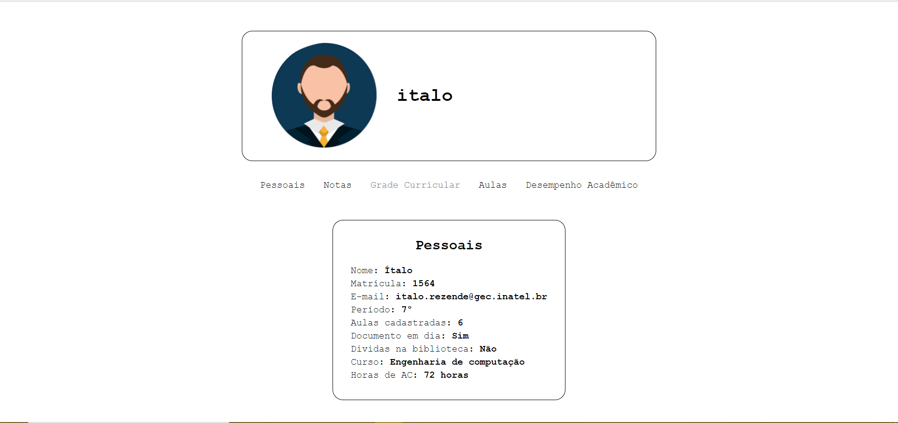

# Desafio-Pumpkin
Desafio realizado para o processo seletivo da empresa PumpkinTech, hospedado pela vercel em https://desafio-pumpkin.vercel.app/

<h4 align="center"> 
  ✔ Finalizado ✔
</h4>


## Como Usar

### Pré-requisitos

Antes de começar, você vai precisar ter instalado em sua máquina as seguintes ferramentas:
[Git](https://git-scm.com), [Node.js](https://nodejs.org/en/). 
Além disto é bom ter um editor para trabalhar com o código como [VSCode](https://code.visualstudio.com/)

### 🎲 Rodando a aplicação

```bash
# Clone este repositório
$ git clone <https://github.com/ItaloRez/Desafio-Pumpkin/>

# Acesse a pasta do projeto no terminal/cmd
$ cd Desafio-Pumpkin

# Instale as dependências
$ npm install

# Execute a aplicação em modo de desenvolvimento
$ yarn dev

# A aplicação inciará na porta:3000 - acesse <http://localhost:3000>
```

## 🛠 Tecnologias

As seguintes ferramentas foram usadas na construção do projeto:

- [Node.js](https://nodejs.org/en/)
- [React](https://pt-br.reactjs.org/)
- [JavaScript](https://www.javascript.com/)
- [react-calendar](https://github.com/wojtekmaj/react-calendar)
- [react-google-charts](https://www.react-google-charts.com/)
- [react-router-dom](https://reactrouter.com/)


## Demonstração

<h1 align="center">
  
</h1>

<h1 align="center">
  
</h1>

## Autor

 </img>
 <br/>
 <sub><b>Ítalo de Rezende</b></sub>🚀


Feito por Ítalo de Rezende 👋🏽 Entre em contato!


[](https://www.linkedin.com/in/%C3%ADtalo-rezende-60a5571b2/) 

[](mailto:italo.rezende@gec.inatel.br)


## Licença


